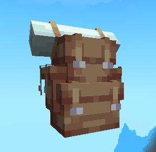

<div align="center">



# HaoHan Backpack (BetterStorage)

Plugin ba lô cá nhân tùy chỉnh cho HaoHan SMP, hỗ trợ lưu trữ SQLite, giao diện GUI tùy biến font/glyph và tích hợp HaoHanItemCore.

[](https://www.minecraft.net/)
[](https://papermc.io/)
[](https://purpurmc.org/)
[](https://openjdk.org/)
[](https://gradle.org/)
[](https://www.sqlite.org/)

Ngôn ngữ: Tiếng Việt | [English](README.en.md)

</div>

## Tổng quan

HaoHan Backpack là plugin Minecraft dành cho HaoHan SMP. Plugin cung cấp hệ thống ba lô cá nhân tùy chỉnh (BetterStorage) với giao diện GUI 54 ô (6 hàng), lưu trữ dữ liệu vật phẩm bền vững bằng SQLite theo UUID riêng biệt cho từng chiếc ba lô, bảo vệ vật phẩm khi chết và ngăn ngừa các lỗi nhân bản (dupe item) triệt để.

## Công nghệ sử dụng

| Toolkit | Vai trò |
| --- | --- |
| Paper API | Nền tảng API chính để phát triển plugin server (1.21+). |
| Purpur | Môi trường server khuyến nghị để triển khai. |
| Java 21 | Ngôn ngữ và runtime chính của plugin. |
| Gradle | Quản lý dependency và build file `.jar`. |
| SQLite JDBC | Cơ sở dữ liệu SQLite lưu trữ dữ liệu vật phẩm ba lô theo UUID. |
| HaoHanItemCore | Plugin phụ thuộc bổ sung (softdepend) cho vật phẩm tùy chỉnh. |

## Yêu cầu

- Minecraft server chạy Paper hoặc Purpur (phiên bản 1.21 trở lên).
- Java 21 trở lên.
- Không cần cài Gradle riêng; dự án có sẵn Gradle Wrapper.
- Cài đặt `HaoHanItemCore` (tùy chọn nhưng khuyến nghị).
- Resource pack đi kèm để hiển thị model ba lô tùy chỉnh (`haohan:backpack`) và giao diện font/glyph custom (`haohan:gui`).

## Cài đặt

1. Build hoặc tải file `.jar` của plugin.
2. Copy file `.jar` vào thư mục `plugins/` của server.
3. Cài resource pack cho client để hiển thị giao diện và model ba lô tùy chỉnh.
4. Khởi động lại server.

Sau lần chạy đầu tiên, plugin sẽ tạo thư mục cấu hình và cơ sở dữ liệu tại `plugins/HaoHanBackpack/config.yml` và `plugins/HaoHanBackpack/backpacks.db`.

## Build từ mã nguồn

Chạy lệnh sau tại thư mục gốc của dự án plugin:

```bash
.\gradlew clean build
```

File `.jar` sau khi build nằm trong thư mục `build/libs/`.

Nếu chỉ cần build nhanh mà không chạy test:

```bash
.\gradlew clean assemble
```

## Lệnh

Lệnh chính của plugin là `/hhbp` (Aliases: `/backpack`, `/bp`, `/balo`).

| Lệnh | Mô tả | Quyền truy cập |
| --- | --- | --- |
| `/hhbp help` | Hiển thị danh sách hướng dẫn lệnh. | Tất cả người chơi |
| `/hhbp give <người chơi> <số lượng>` | Trao ba lô thám hiểm cho người chơi chỉ định. | `haohanbackpack.give` |
| `/hhbp list` | Hiển thị danh sách ID ba lô đã lưu của bản thân. | Mặc định |
| `/hhbp info <người chơi\|UUID>` | Kiểm tra thông tin dữ liệu ba lô theo UUID hoặc tên người chơi. | `haohanbackpack.admin` |
| `/hhbp delete <người chơi\|UUID>` | Xóa dữ liệu ba lô trong cơ sở dữ liệu. | `haohanbackpack.admin` |
| `/hhbp reload` | Nạp lại cấu hình `config.yml`. | `haohanbackpack.admin` |

## Permission

| Permission | Mặc định | Mô tả |
| --- | --- | --- |
| `haohanbackpack.use` | Tất cả người chơi | Cho phép người chơi sở hữu và mở ba lô thám hiểm. |
| `haohanbackpack.give` | OP | Cho phép sử dụng lệnh `/hhbp give` để tạo ba lô. |
| `haohanbackpack.admin` | OP | Cho phép quản trị viên xem info, xóa dữ liệu và reload plugin. |

## Cấu hình & Tính năng

Tệp cấu hình chính nằm tại `plugins/HaoHanBackpack/config.yml`:

```yaml
title: '&8Ba lô của %player%'
custom-gui:
  enabled: true
  font: 'haohan:gui'
  prefix: ''
  glyph: ''
rows: 6
backpack-item-name: '&b&lBa lô thám hiểm'
backpack-item-model: 'haohan:backpack'
backpack-item-lore:
  - '&7Chuột phải để mở ba lô cá nhân.'
  - '&8Dung lượng: 53 ô + 1 module'
database:
  file: backpacks.db
backpack-limit:
  enabled: false
  default: 1
blocked-materials: []
keep-backpacks-after-death: true
block-backpack-in-containers: true
allow-backpacks-inside-backpacks: false
hopper:
  enabled: true
backpack-collision:
  enabled: true
```

### Cơ chế chống Dupe & An toàn dữ liệu

- **Định danh UUID riêng biệt**: Mỗi chiếc ba lô khi được tạo ra có một UUID duy nhất gắn vào NBT/PDC (`PersistentDataContainer`). Ba lô không bị chồng hàng (stack) để đảm bảo không mất dữ liệu.
- **Khóa container**: `block-backpack-in-containers: true` ngăn chặn người chơi mở ba lô khi đang thao tác trong rương, shulker box hay bất kỳ container nào khác.
- **Ngăn lồng ba lô**: `allow-backpacks-inside-backpacks: false` ngăn người chơi bỏ ba lô này vào trong một ba lô khác.
- **Bảo vệ khi chết**: `keep-backpacks-after-death: true` tự động giữ lại ba lô trong túi đồ khi người chơi hy sinh, tránh việc làm rơi hoặc mất vật phẩm lưu trữ trong ba lô.
- **Tích hợp Hopper**: Quản lý việc di chuyển ba lô qua Phễu (Hopper) an toàn.

## Ghi chú vận hành

- Dữ liệu ba lô được lưu trực tiếp vào cơ sở dữ liệu SQLite `backpacks.db`. Hãy thực hiện backup file này định kỳ.
- Không chỉnh sửa trực tiếp file `backpacks.db` khi server đang chạy.
- Khi cập nhật cấu hình trong `config.yml`, áp dụng thay đổi bằng lệnh `/hhbp reload`.
